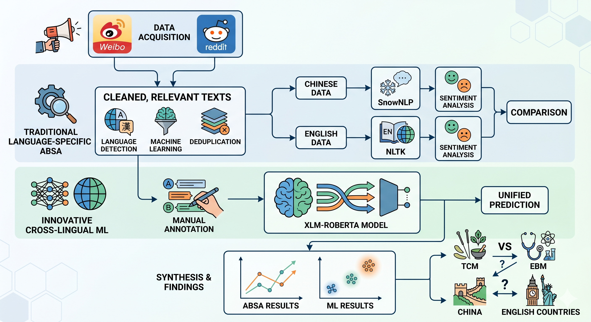

# Post-COVID Trust in Traditional Chinese Medicine (TCM): *An Opinion Mining Study*
[Link to this repo](https://github.com/P-mandevillei/trust_in_tcm_opinion_mining)

## Directory Overview
- `corpus`: contains the raw and processed texts, as well as the metadata
- `scraping`: contains the scripts for Reddit scraping and text pre-processing, as well as raw Reddit texts
- `MediaCrawler`: [the open-source tool](https://github.com/NanmiCoder/MediaCrawler) for scraping Chinese media texts. Stores raw Weibo texts in database/sqlite_tables.db.
- `results`: contains all resulting figures and tables of the study, as well as the weights for the best machine learning models
  

## Important Files
- `trust_analysis.ipynb`: the main notebook for the study with all the analysis codes
- `scraping/scraping.ipynb`: the notebook for scraping Reddit texts and pre-processing of both Reddit and Weibo texts
- `scraping/scrape_keywords`: directory containing the keywords used for scraping
- `corpus/metadata_with_absa_scores_and_trust.csv`: the metadata spreadsheet containing all source-tracking and research variables (except for source URLs for privacy reasons; the URLs can be found in the full metadata: `corpus/combined/combined_corpus_by_name_relevance_filtered_dedup.csv`). **Note the metadata tracks the posts by `note_id`**
- `corpus/cleaned/posts_by_noteid.parquet`: cleaned Reddit and Weibo posts (the main corpus).
- `corpus/absa/parsed_cleaned_posts.parquet`: ABSA-processed Reddit and Weibo posts.

## Replication of Results

Generally, follow the Jupyter Notebooks ***strictly in sequence*** to replicate the results. (There are lots of overriding variables in the notebooks, so be careful.) Special considerations will be noted inside the Notebooks, including everything mentioned below. Refer to `requirements.txt` for the required packages. The relative paths in the notebooks either assume that the notebooks are run locally from the project root directory, or from a Google Colab notebook within the mounted Google Drive. The latter will be noted in the relevant sections. 
Do ***NOT*** expect to replicate the scraping results, since the posts are dynamic. 
To replicate the pre-processing results, follow the `scraping/scraping.ipynb` notebook. Note that the transformer encoding step is performed by connecting to [Google Colab](https://colab.research.google.com/) on one of the GPUs, and the import commands are in the second cell of the Notebook (***do not run the first cell on Colab***). Change the paths accordingly when you mount your Google Drive.  
To replicate the analyses, follow the `trust_analysis.ipynb` notebook. Note that for the manual annotation step for trust classification, it was performed on a pre-selected random subset of the data. Since the data has been re-ordered since then, re-running the sampling step will not yield the same rows. Also note that the training and prediction steps of the transformer models are performed on Google Colab with GPU. Like with the preprocessing, change the paths accordingly when you mount your Google Drive and run the second cell for imports. 
Always be mindful of memory constraints when you run the notebook. Steps like training the transformer models and parallel processing of the dataset are memory-intensive. 
**Use your own tokens when required by the code. My tokens are not provided for obvious reasons, and running without them might result in errors.**

## Preprocessing -- `scraping/scraping.ipynb`

This notebook handles the initial data acquisition, cleaning, and filtering pipeline. Because social media scraping returns a high volume of noisy or completely unrelated data, this notebook uses both rule-based filtering and a machine learning classifier to clean the dataset.

### Notebook Structure
**1. Scraping & Standardizing Reddit (English)**
*   **Data Acquisition**: Posts are scraped using the Reddit json API, targeting English medicine keywords.
*   **Filtering**: Filtered for posts on or after 2019 that match at least one keyword.
*   **Restructuring**: The data is pivoted longer to organize by `post_id` and `medicine_name`.
*   **Language Identification**: The `fasttext` model is used to filter out posts that are not in English.

**2. Scraping & Standardizing Weibo (Chinese)**
*   **Data Acquisition**: Posts are scraped using [MediaCrawler](https://github.com/NanmiCoder/MediaCrawler), targeting Chinese medicine keywords.
*   **Filtering**: Filtered for posts on or after 2019 that match at least one keyword.
*   **Restructuring**: The data is pivoted longer to organize by `post_id` and `medicine_name`.
*   **Language Identification**: The `fasttext` model is used to filter out posts that are not in Chinese.

**3. Relevance Filtering & Deduplication**
*   **Manual Annotation**: Random samples from the combined Reddit and Weibo datasets are manually annotated for medical relevance.
*   **Feature Extraction**: `xlm-roberta-base` is used to extract embeddings for the posts.
*   **Logistic Regression Classifier**: The manual annotations are used to train a logistic regression classifier that predicts whether a post is discussing the medicine from the perspective of a patient.
*   **Classify & Commit**: The trained classifier evaluates the entire dataset and unrelated posts are removed. The final cleaned dataset is deduplicated and stored for downstream analysis.

## Analyses -- `trust_analysis.ipynb`

This notebook assigns sentiment scores and trust levels to the scraped Reddit and Weibo posts, and performs statistical analyses. Two distinct methodologies were used: a rule-based Aspect-Based Sentiment Analysis (ABSA) approach and a predictive machine learning model.

### Notebook Structure
**1. Aspect-Based Sentiment Analysis (ABSA)**
*   **Dependency Parsing**: `spaCy` (English and Chinese models) is used to extract grammatical dependencies of the medicine keywords.
*   **Sentiment Scoring**: The sentiment of those extracted aspects is analyzed using VADER (for English) and SnowNLP (for Chinese).
*   **Deduplication & Aggregation**: The results are merged and cleaned, and sentiment scores are normalized to a scale of `[0, 1]`.

**2. Machine Learning Classifier**
*   **Dataset**: ABSA-extracted components are used as inputs to train a transformer model to predict nuanced trust. Manual annotation was performed on a pre-selected random subset of the data.
*   **Training & Classification**: `xlm-roberta-large` is fine-tuned to predict trust.

**3. Statistical Analysis**
A series of statistical tests are performed on both ABSA and ML results to answer the following research questions:
*   **Temporal Shifts**: Is there a difference between COVID and post-COVID opinions on the same types of medicines?
*   **Medicine Types**: Is there a difference between post-COVID opinions regarding EBM vs. TCM?
*   **Geocultural Preferences**: Is there a difference between post-COVID preferences for TCM on Weibo vs. Reddit?
*   **Upvote-Weighted Analysis**:
To account for community consensus and visibility, all these analyses are repeated using data weighted by user upvotes/likes.
